# shri-2020-home-task-DevTools

### Network

- HAR архив лежит в репозитории - `lifehacker.ru.har`

- дублирование ресурсов

  В основном дублируются рекламные скрипты.

  

  
Дублирование 1

  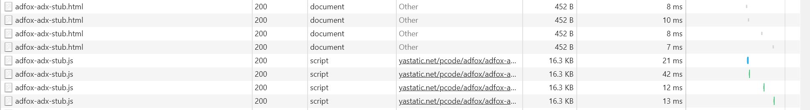
  

  

  
Дублирование 2

  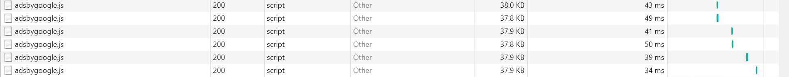
  

  

  
Дублирование 3

  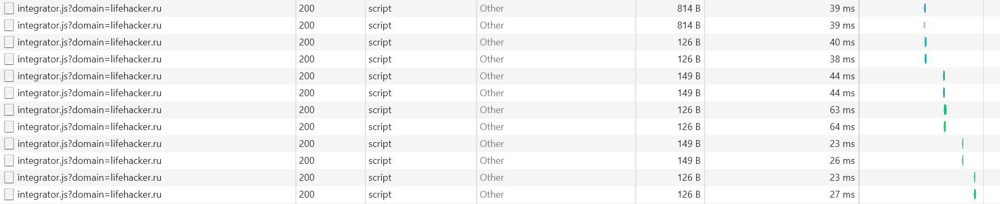
  

  

  
Дублирование 4

  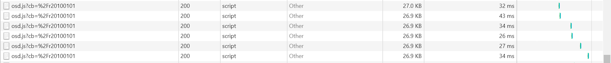
  

  

  
Дублирование 5

  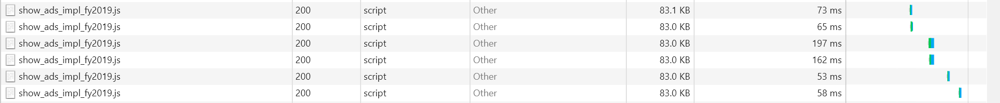
  

- лишний размер ресурса

  Есть несколько несжатых jpeg картинок и большие скрипты, значительная часть кода которых не используется. Некоторые скрипты и стили грузятся в нескольких версиях.

  

  
Лишний размер

  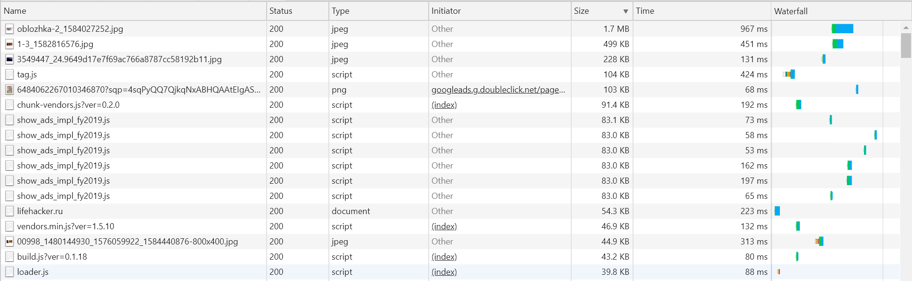
  

- медленно загружающиеся ресурсы

  Дольше всего грузятся несжатые картинки и некоторые скрипты.

  

  
Медленная загрузка

  
  

- ресурсы, блокирующие загрузку

  В основном это js-скрипты и css

  

  
Блокирование загрузки

  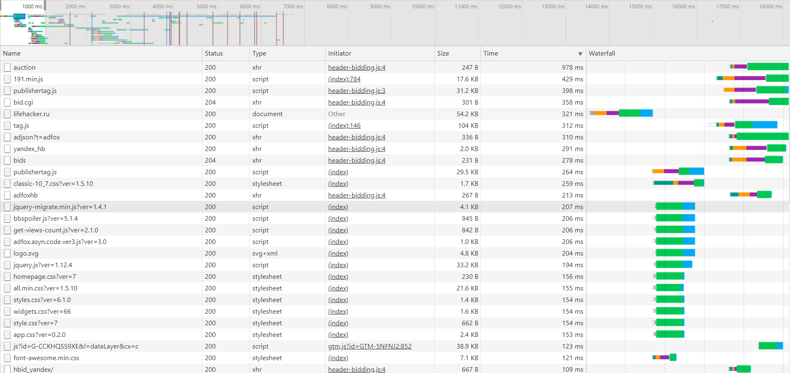
  

### Performance

- профиль загрузки страницы лежит в репозитории - `performance-profile.json`

- время в миллисекундах от начала навигации до событий
  - **First Paint:** 671.9 ms
  - **First Meaningful Paint:** 1405.4 ms
  - **DOM Content Loaded:** 2935.8 ms
  - **Load:** 6250.3 ms

- сколько времени в миллисекундах тратится на разные этапы обработки документа
  - **Loading:** 104 ms
  - **Scripting:** 2578 ms
  - **Rendering:** 1412 ms
  - **Painting:** 257 ms

### Coverage

- скриншот вкладки после загрузки страницы
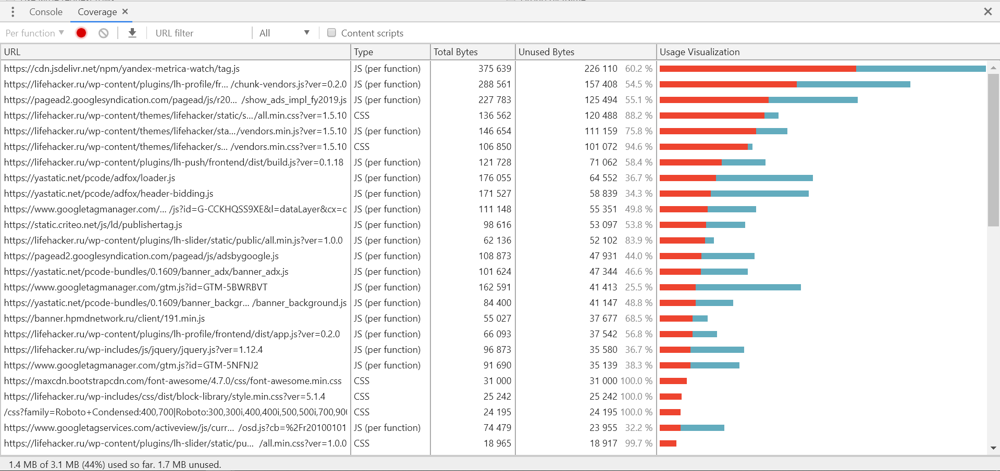

- объём неиспользованного CSS: 387 KB

- объём неиспользованного JS: 1.4 MB

### Audits

Запустил также audits для данной страницы, результаты ниже. Из результатов можно быстро узнать, с чего стоит начать оптимизацию.

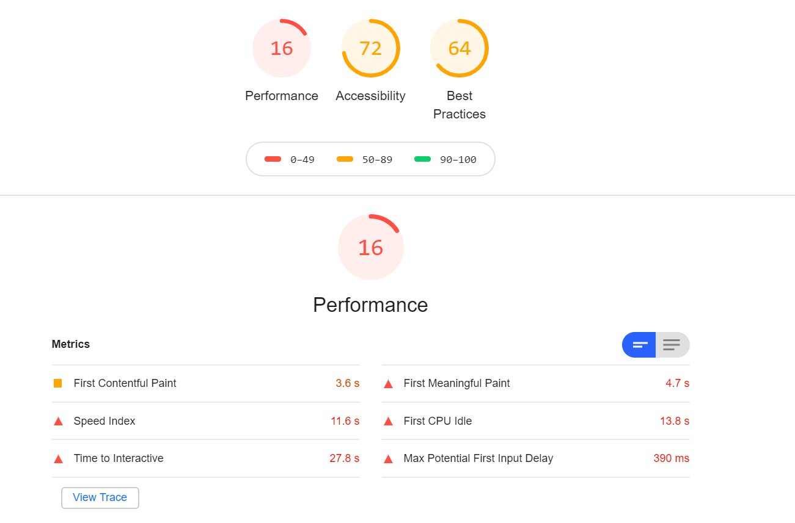
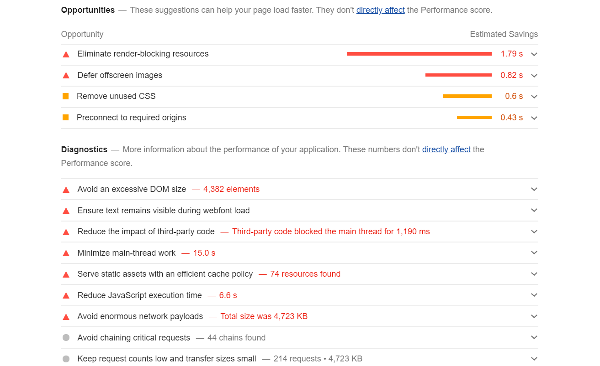

## Бонус - CPU 4x slowdown + Slow 3G

### Network

При медленном соединении очень долго грузятся шрифты ~ 1 мин, а также несжатые изображения и js скрипты.

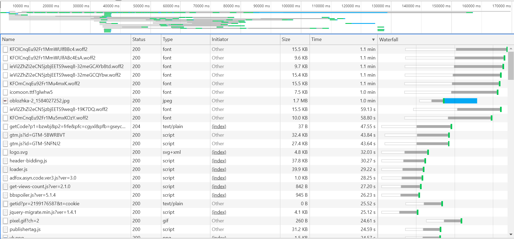

### Performance

- время в миллисекундах от начала навигации до событий
  - **DOM Content Loaded:** 51923.9 ms
  - **Load:** 477193.3 ms

- сколько времени в миллисекундах тратится на разные этапы обработки документа
  - **Loading:** 327 ms
  - **Scripting:** 7448 ms
  - **Rendering:** 12265 ms
  - **Painting:** 1 ms
